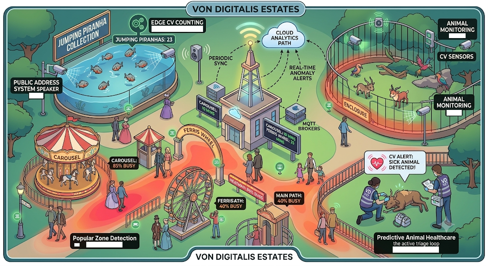
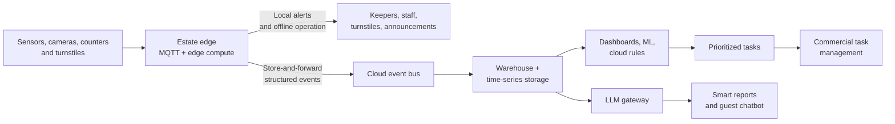

# Von Digitalis Estates: Architecture Overview

This repository documents the architecture for Von Digitalis Estates: a large visitor estate with 40 rides, 55 animal displays, more than 200 animals, and growth from approximately 5,000 to 15,000 visitors per day.

The central design challenge is to combine reliable local operation with useful cloud analytics despite patchy Wi-Fi. The team addressed this by keeping safety, ticket validation, and first-response processing at the estate edge, while sending durable, structured events to the cloud for historical analysis, task generation, dashboards, and AI-assisted experiences.

## Table of Contents

- [Team](#team)
- [Problem Statement](#problem-statement)
- [Solution Overview](#solution-overview)
- [Architecture at a Glance](#architecture-at-a-glance)
- [Key Decisions](#key-decisions)
- [Assumptions and Constraints](#assumptions-and-constraints)
- [Risks and Trade-offs](#risks-and-trade-offs)
- [Repository Structure](#repository-structure)

## Team

Originally Exhibit #1 in the Von Digitalis collection, the Intercontinental Ballistic Magpies (ICBM) mutated into a hyper-intelligent hive-mind from exposure to explosive garden gnome testing. After silently orchestrating the last heir's "gardening accident", ICBM broke out, scavenged the estate's hardware, and seized the network.

- [Vedant](https://www.linkedin.com/in/vedant-iyangar/)
- [Rithwik](https://www.linkedin.com/in/rithwik)
- [Hariprasath](https://www.linkedin.com/in/hariprasath-shanmugam-0a6973166/)
- [Sukumar](https://www.linkedin.com/in/sukumar-mennan-ponnalagu/)
- [Aravind](https://www.linkedin.com/in/aravind-8105877020/)
- [Shreyas](https://www.linkedin.com/in/mahajan-shreyas/)

## Problem Statement

Von Digitalis Estates needs to:

- keep entrances, rides, and animal operations working when cloud connectivity is unavailable;
- monitor animal welfare and ride conditions across a physically distributed estate;
- understand crowd density, queue pressure, and zone popularity without creating unnecessary visitor-identity or privacy risk;
- turn telemetry and anomalies into prioritized work for staff;
- support visitor-facing reporting and assistance without coupling the estate to one AI provider; and
- scale operational data flows as visitor numbers grow threefold.

The architecture must therefore balance immediate local response, resilient data collection, privacy, operational simplicity, and controlled use of AI.

## Solution Overview

The team chose an event-driven architecture with a local MQTT broker and edge compute at the estate boundary. Sensors, ticket counters, turnstiles, and computer-vision nodes publish events locally. Persistent queues retain events during outages and synchronize them to the cloud when connectivity returns. Consumers deduplicate events using stable identifiers, accepting eventual consistency for cloud dashboards and analytics in exchange for reliable local operation.

At the edge, computer vision extracts non-biometric counts and animal-health signals in memory; raw video is not stored or transmitted. LoRaWAN connects remote, low-power sensors to the edge server, while safety-critical control paths remain wired. Signed tickets and delegated keys allow offline ticket issuance and validation. Local rules trigger sub-second safety and emergency responses without depending on the WAN.

In the cloud, structured events are stored in a warehouse and time-series platform for dashboards, predictive models, and a cloud rules engine. The rules engine correlates events over time, prioritizes tasks, and sends approved work to a commercial task-management platform. A provider-agnostic LLM gateway supports smart reporting and a guest chatbot with access control, redaction, guardrails, provider fallback, and audit logging.

## Architecture at a Glance

The detailed version is in [`diagrams/overall_architecture.md`](diagrams/overall_architecture.md).

## Key Decisions

| Concern | Decision | Rationale |
|---|---|---|
| Event delivery | Event bus with edge store-and-forward ([ADR-001](adrs/%5BADR-001%5D%20Event%20Driven%20Architecture.md)) | Local operation continues through network interruptions and cloud consumers can process events asynchronously. |
| Crowd analytics | Edge computer vision with anonymized aggregation ([ADR-002](adrs/%5BADR-002%5D%20Edge%20Computer%20Vision.md)) | Provides useful counts and density without BLE/RFID identity tracking or raw-video transmission. |
| Ticketing | Asymmetric cryptography with delegated edge keys ([ADR-003](adrs/%5BADR-003%5D%20Asymmetric%20cryptography%20for%20ticketing%20systems.md)) | Tickets can be issued and verified offline while limiting replay and key-compromise risk. |
| Emergency response | Local edge rules engine ([ADR-004](adrs/%5BADR-004%5D%20Local%20Edge%20Rules%20Engine.md)) | Safety and animal alerts need predictable, sub-second behavior independent of cloud latency. |
| Staff workflow | Integrate a commercial task platform ([ADR-005](adrs/%5BADR-005%5D%20Task%20management%20system.md)) | Provides mature offline mobile workflows while the team focuses on estate-specific intelligence. |
| Data platform | Cloud warehouse and time-series storage ([ADR-006](adrs/%5BADR-006%5D%20Data%20Warehouse%20over%20Data%20Lake.md), [ADR-007](adrs/%5BADR-007%5D%20Timeseries%20Database.md)) | Structured telemetry at the estate’s scale does not justify a full data-lake ecosystem. |
| Animal welfare | Sensor-fused edge computer vision ([ADR-008](adrs/%5BADR-008%5D%20Sensor%20Fused%20Edge%20Computer%20Vision%20for%20Animal%20welfare%20monitoring.md)) | Combines visual, environmental, and feeding signals locally and sends compact health events upstream. |
| Connectivity | Private LoRaWAN for distributed sensors ([ADR-009](adrs/%5BADR-009%5D%20LoRaWAN%20for%20Estate%20Sensor%20Connectivity.md)) | Extends low-power sensor coverage without putting every device on Wi-Fi or requiring direct cloud WAN access. |
| AI governance | Cloud-agnostic LLM gateway ([ADR-010](adrs/%5BADR-010%5D%20LLM%20Gateway%20for%20Smart%20Reporting%20and%20Chatbot.md)) | Centralizes provider routing, guardrails, access control, cost controls, and auditability. |
| Operations intelligence | Cloud rules engine with human-approved rule promotion ([ADR-011](adrs/%5BADR-011%5D%20Cloud%20Rules%20Engine%20for%20Anomaly-Driven%20Prioritized%20Tasks.md)) | Correlates historical signals and prioritizes tasks without allowing ML-generated rules to activate automatically. |

## Assumptions and Constraints

- The Local Edge Server has a reliable, high-uptime wired connection to the cloud for synchronization and critical remote commands.
- The local MQTT broker uses disk-backed queues when that connection is unavailable.
- Raw camera footage is processed locally and is not part of the cloud data platform.
- LoRaWAN is used for low-bandwidth sensing, not for ride emergency stops or other sub-second safety control loops.
- Cloud analytics may be eventually consistent; immediate safety behavior remains local.

The connectivity assumption and its mitigations are documented in [`assumptions/1. Reliable Connectivity.md`](assumptions/1.%20Reliable%20Connectivity.md).

## Risks and Trade-offs

- **Eventual consistency:** cloud dashboards and models may lag during an outage; local queues preserve the data for later processing.
- **Edge fleet complexity:** many edge nodes require OTA updates, health monitoring, and model/configuration management.
- **Privacy versus personalization:** anonymized crowd analytics prevent persistent cross-visit profiles, but the decision keeps the primary operational use case safer and simpler.
- **Polyglot persistence:** ticketing, tasks, warehouse data, and time-series telemetry use different storage needs and interfaces.
- **AI uncertainty:** the LLM gateway reduces provider and governance risk, while local and cloud rules engines provide deterministic operational boundaries.

## Repository Structure

- [`adrs/`](adrs/) — architecture decisions and their trade-offs.
- [`assumptions/`](assumptions/) — explicit environmental and connectivity assumptions.
- [`diagrams/`](diagrams/) — the overall architecture and supporting visual artefacts.
- [`ai/`](ai/) — supporting AI overview, software-stack, and cost analysis.
- [`transcripts/`](transcripts/) — source discussions used to develop the decisions.
