## ADR [009]: LoRaWAN for Distributed Estate Sensor Connectivity

### Status
- PROPOSED

### Context
Wi-Fi coverage across the Von Digitalis estate is patchy, and 40 rides plus 55 animal enclosures are spread across a large, sprawling area — many remote and without existing power or cabling. [ADR-001](./%5BADR-001%5D%20Event%20Driven%20Architecture.md) and [ADR-004](./%5BADR-004%5D%20Local%20Edge%20Rules%20Engine.md) already solve edge-to-cloud resilience via store-and-forward, and the [connectivity assumption](../assumptions/1.%20Reliable%20Connectivity.md) treats the Edge Server-to-Cloud link as reliable and wired. The unresolved gap is **local, last-mile connectivity from distributed sensors to the Edge Server** itself.

### Decision
Deploy a private LoRaWAN network across the estate:
- **End devices** (Class A, OTAA join, battery/solar powered): environmental probes, water quality sensors, feeder load cells, foot-traffic/occupancy counters, and non-safety ride usage/cycle counters.
- **Gateways**: multiple, overlapping outdoor units for coverage redundancy (the LoRaWAN spec natively dedupes repeated uplinks received across gateways). PoE Ethernet backhaul where wired infrastructure reaches; 4G/LTE cellular backhaul for remote gateways beyond wired reach.
- **Network Server**: self-hosted, open-source (ChirpStack) as a containerized service on the existing Edge Compute Server. Decoded uplinks are republished as MQTT events on the existing Local MQTT Broker, reusing the sub-1KB structured event pattern from [ADR-008](./%5BADR-008%5D%20Sensor%20Fused%20Edge%20Computer%20Vision%20for%20Animal%20welfare%20monitoring.md).
- **Explicit exclusions**: CV video streams (stay on local CV compute per ADR-008) and ride safety/e-stop signals or any sub-second control loop (stay wired per ADR-004) — LoRaWAN's duty-cycle limits and Class A latency make it unsuitable for safety-critical control.
- **Security**: OTAA with unique per-device keys, key rotation, TLS on the ChirpStack-to-MQTT bridge.

```mermaid
flowchart LR
    classDef sensor fill:#eef9ff,stroke:#007acc,stroke-width:1.5px;
    classDef gateway fill:#fff4e6,stroke:#e67e22,stroke-width:1.5px;
    classDef edge fill:#f9fbfd,stroke:#2b5c8f,stroke-width:1.5px;
    classDef excluded fill:#fdecea,stroke:#c0392b,stroke-width:1.5px,stroke-dasharray: 4 3;

    subgraph Sensors["LoRaWAN End Devices (Class A, OTAA, battery/solar)"]
        direction TB
        Env[Environmental & Water<br/>Quality Probes]
        Load[Feeder Load Cells]
        Foot[Foot-Traffic /<br/>Occupancy Counters]
        Ride[Non-Safety Ride<br/>Usage / Cycle Counters]
    end

    subgraph Gateways["LoRaWAN Gateways (overlapping coverage)"]
        direction TB
        GW1[Gateway A<br/><i>PoE Ethernet backhaul</i>]
        GW2[Gateway B<br/><i>4G / LTE backhaul</i>]
        GW3[Gateway C<br/><i>PoE Ethernet backhaul</i>]
    end

    subgraph EdgeServer["Edge Compute Server (on-premise)"]
        direction TB
        NS[Self-Hosted Network Server<br/><i>ChirpStack, containerized</i>]
        Broker[Local MQTT Broker]
        Rules[Local Rules Engine]
        NS -->|"Decoded Uplinks as<br/>MQTT Events (&lt;1KB JSON)"| Broker
        Broker <--> Rules
    end

    subgraph ExcludedPaths["Explicitly Out of Scope for LoRaWAN"]
        direction TB
        CV["CV Video Streams<br/>(local CV compute, ADR-008)"]:::excluded
        Safety["Ride Safety / E-Stop Signals<br/>(wired, sub-second, ADR-004)"]:::excluded
    end

    Sensors -->|"Uplink (duty-cycle limited)"| Gateways
    Gateways -->|"Backhaul"| NS
    Broker -.->|"Store-and-Forward Sync<br/>(existing ADR-001 mechanism)"| Cloud[(Cloud MQTT Broker)]

    class Env,Load,Foot,Ride sensor;
    class GW1,GW2,GW3 gateway;
    class NS,Broker,Rules edge;
```

### Alternatives Considered
1. *Managed cloud Network-Server-as-a-service with estate-owned gateways* (e.g. AWS IoT Core for LoRaWAN). **Rejected as primary**: requires each gateway to have its own reliable WAN path directly to the cloud, reintroducing the patchy-connectivity problem this ADR exists to solve, and duplicates outage-buffering logic already solved centrally at the Edge Server. Revisit if the estate later wants to fully offload network-server operations.
2. *Public/community LoRaWAN network* (Helium, TTN community). **Rejected**: no existing public gateway coverage can be assumed on a private rural estate.
3. *Wi-Fi mesh range extenders*. **Rejected**: far shorter range, higher power draw, and mains-power dependency versus LoRaWAN for remote enclosures.
4. *Private cellular / NB-IoT / LTE-M sensors*. **Rejected as the primary sensor layer**: recurring SIM cost per device is disproportionate for hundreds of low-data sensors; kept in reserve only as a gateway backhaul option.

### References
- [LoRa Alliance Specification](https://lora-alliance.org/resource_hub/lorawan-specification-v1-1/)
- [ChirpStack Documentation](https://www.chirpstack.io/docs/)
- [ADR-001](./%5BADR-001%5D%20Event%20Driven%20Architecture.md)
- [ADR-004](./%5BADR-004%5D%20Local%20Edge%20Rules%20Engine.md)
- [ADR-008](./%5BADR-008%5D%20Sensor%20Fused%20Edge%20Computer%20Vision%20for%20Animal%20welfare%20monitoring.md)

### Date
2026-09-16