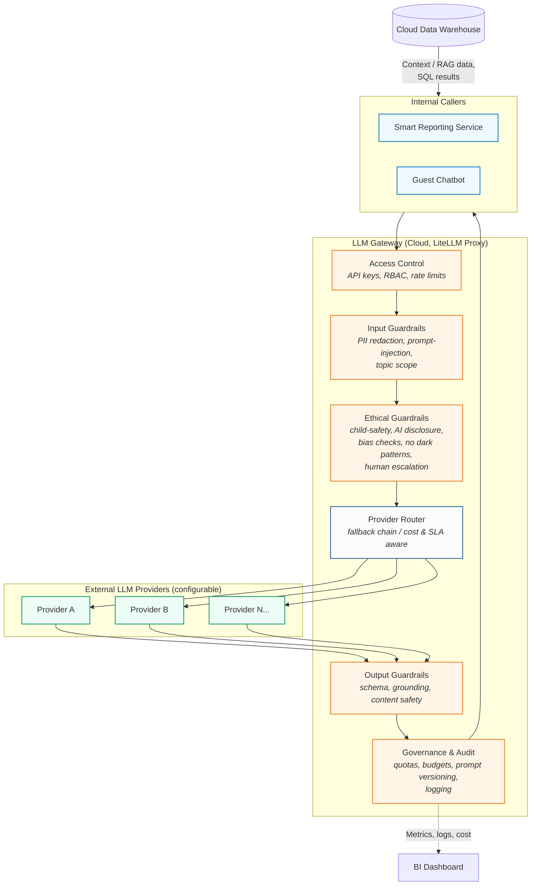

## ADR [010]: Cloud-Agnostic LLM Gateway for Smart Reporting and Guest Chatbot

### Status
- PROPOSED

### Context
Telemetry and operational data across rides, animal enclosures, and ticketing flows into the Cloud Data Warehouse ([ADR-006](./%5BADR-006%5D%20Data%20Warehouse%20over%20Data%20Lake.md)). This data will power AI-generated "Smart Reports" for staff and a guest-facing chatbot ([diagrams/overall_architecture.md](../diagrams/overall_architecture.md)) that answers customised report requests via one or more LLMs. Calling multiple external LLM providers directly from application code would couple the estate to a single vendor's API, pricing, and availability — an explicit risk for this kata ("what happens if your model provider changes price or shuts down?") — and would leave no consistent place to enforce guardrails, cost governance, ethical safeguards, or access control across two very different callers: an internal reporting service and a public-facing, family-visited chatbot.

### Decision
Introduce a single, cloud-hosted, self-hosted **LLM Gateway** as the only component permitted to call external LLM providers:

- **Software**: LiteLLM Proxy, deployed as a container in the cloud environment alongside the Data Warehouse/BI stack. Open-source and provider-agnostic, avoiding lock-in to any single cloud's native AI gateway (e.g. Bedrock Gateway, Azure AI Studio).
- **Provider abstraction**: Backend providers are configured, not hardcoded; a per-use-case fallback chain (primary → secondary model/provider) handles outages, latency SLA breaches, or cost-threshold triggers without application code changes.
- **Guardrails**:
  - *Input*: mandatory PII/PHI redaction on any visitor data before it leaves the gateway boundary, prompt-injection detection, and topic-scope filtering for the guest chatbot.
  - *Output*: JSON-schema enforcement for Smart Report structure, grounding/hallucination checks against retrieved Data Warehouse rows, and content-safety filtering before any response reaches a visitor.
  - *Ethical*: child-appropriate content filtering (the estate is family-visited), mandatory AI-disclosure so guests know they are talking to an automated assistant, bias/fairness checks on staff-facing Smart Reports to prevent discriminatory scoring (e.g. of staff performance or animal-enclosure prioritisation), a ban on manipulative/dark-pattern upsell language in guest-facing responses, and mandatory human escalation for sensitive topics such as animal welfare complaints or safety incidents rather than fully automated replies.
- **Governance**: per-caller (chatbot vs. internal reporting) model allow-lists, budget/quota alerts, full audit logging of prompts and responses, and versioned prompt templates.
- **Access control**: API-key/OAuth per calling service, RBAC scoping (chatbot = narrow, read-only report access; internal reporting = broader), per-key rate limiting and token quotas.
- **Data-access pattern**: for text-to-SQL style chatbot queries, the LLM only *generates* SQL. The gateway/application layer validates it against an allow-list of views and row-level security, executes it read-only, then feeds real results back to the LLM to phrase the final answer — keeping non-deterministic language generation separate from deterministic data access.
- **Monitoring**: request/response logs (redacted), token usage, cost, latency, and guardrail-trigger events (including ethical-guardrail triggers) feed into the existing BI Dashboard rather than a separate tool.

### Alternatives Considered
1. *Direct integration with a single cloud-native gateway* (AWS Bedrock Gateway, Azure AI Studio). **Rejected**: ties the estate to one cloud's model catalog and pricing, contradicting the cloud-agnostic requirement and the kata's explicit provider-risk concern.
2. *Each service (chatbot, reporting) calls LLM providers directly.* **Rejected**: no single point to enforce guardrails, redact PII, apply ethical checks, or govern cost/access; duplicated logic across services; no consistent audit trail.
3. *Self-hosted open-weight model only (no external providers).* **Rejected as sole approach**: reduces external dependency, but sacrifices access to more capable frontier models for complex report generation; kept as a future fallback tier rather than the only tier.

### References
- LiteLLM Proxy documentation
- [ADR-006](./%5BADR-006%5D%20Data%20Warehouse%20over%20Data%20Lake.md)

### Date
2026-09-16
