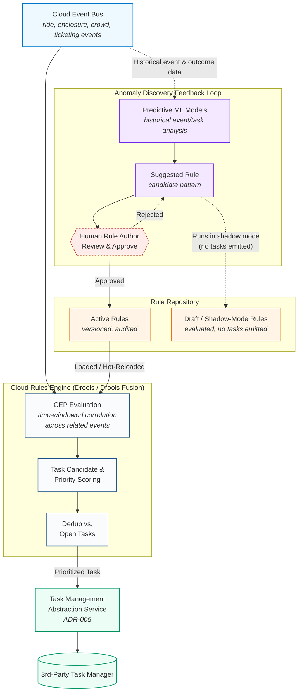

## ADR [011]: Cloud Rules Engine for Anomaly-Driven Prioritized Task Generation

### Status
- PROPOSED

### Context
Park events (ride telemetry, animal enclosure sensors, crowd density, ticketing) flow into the Cloud Event Bus ([ADR-001](./%5BADR-001%5D%20Event%20Driven%20Architecture.md)). Staff need a system that evaluates these events, correlates related signals, and generates a prioritized task list dispatched into the commercial Task Management platform ([ADR-005](./%5BADR-005%5D%20Task%20management%20system.md)). Unlike the [Local Edge Rules Engine](./%5BADR-004%5D%20Local%20Edge%20Rules%20Engine.md) — which handles offline, sub-second safety triggers at the park edge — this engine operates in the cloud with full historical context and must (a) correlate multiple related events over time rather than react to single events in isolation, and (b) allow rules to be updated as new anomaly patterns are discovered, without redeploying the service.

### Decision
Deploy a cloud-hosted **Business Rules Management System with Complex Event Processing (CEP)** capability — **Drools (with Drools Fusion)** or an equivalent open-source, cloud-agnostic BRMS:

- **Rule Repository**: versioned, audit-tracked store of rule definitions (author, effective dates, active/draft/shadow status). Rules are data, not code — updating a rule is a repository change, not a redeploy.
- **Hot-reloadable Rule Engine**: subscribes to the Cloud Event Bus, evaluates events (including time-windowed correlation across related signals — e.g. ride vibration + usage-cycle count + time-since-maintenance) against the currently active rule set, and reloads rule sessions on repository changes without downtime.
- **Task Candidate & Priority Scoring**: rule matches emit a task candidate with a priority score (e.g. safety > animal welfare > guest experience > routine maintenance), deduplicated against existing open tasks to avoid alert-storm duplication, then forwarded to the Task Management Abstraction Service (ADR-005).
- **Anomaly-discovery feedback loop with mandatory human gate**: Predictive ML models analyze historical event/task-outcome data to surface candidate anomaly patterns not covered by existing rules. These become **draft rules in shadow mode** — evaluated against live events without generating real tasks — and require explicit human review and approval before promotion to active. No ML-suggested rule may auto-activate.
- **Separation from the Local Edge Rules Engine (ADR-004)** is intentional and retained: the edge engine stays focused on offline, sub-second safety triggers; this cloud engine focuses on cross-zone correlation, historical context, and task prioritization. They are not unified.

### Alternatives Considered
1. *Hand-rolled if/else rules service.* **Rejected**: rule changes require code deploys, failing the "update on the fly" requirement, and lacks native event correlation — every new correlation pattern becomes bespoke code.
2. *Fully automatic ML-driven rule creation and activation (no human gate).* **Rejected**: an incorrect auto-generated rule could silently misprioritize staff dispatch around safety or animal welfare with no review step — unacceptable given the stakes.
3. *Unify with the Local Edge Rules Engine (ADR-004) into one rules engine.* **Rejected**: the two have fundamentally different constraints — edge requires offline operation and sub-second latency; cloud requires historical context, cross-zone correlation, and dynamic rule authoring. Merging them would compromise both.

### References
- Drools / Drools Fusion documentation
- [ADR-001](./%5BADR-001%5D%20Event%20Driven%20Architecture.md)
- [ADR-004](./%5BADR-004%5D%20Local%20Edge%20Rules%20Engine.md)
- [ADR-005](./%5BADR-005%5D%20Task%20management%20system.md)

### Date
2026-09-16
