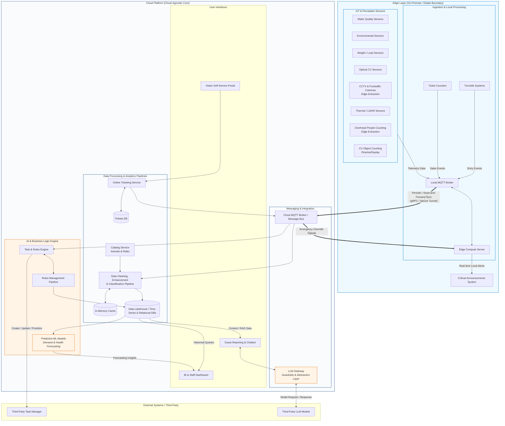

```mermaid
flowchart TB
    %% ==========================================
    %% EDGE ENVIRONMENT (Von Digitalis Estates)
    %% ==========================================
    subgraph Edge["Edge Layer (On-Premise / Estate Boundary)"]
        direction TB
        
        subgraph Sensors["IoT & Perception Sensors"]
            S1[Water Quality Sensors]
            S2[Environmental Sensors]
            S3[Weight / Load Sensors]
            S4[Optical CV Sensors]
            S5[CCTV & Foottraffic Cameras\n<i>Edge Extraction</i>]
            S6[Thermal / LiDAR Sensors]
            S7[Overhead People-Counting\n<i>Edge Extraction</i>]
            S8[CV Object Counting\n<i>Piranha/Display</i>]
        end

        subgraph Ingestion["Ingestion & Local Processing"]
            EdgeBroker[Local MQTT Broker]
            EdgeServer[Edge Compute Server]
            Turnstile[Turnstile Systems]
            TicketCounter[Ticket Counters]
        end

        Sensors -->|Telemetry Data| EdgeBroker
        Turnstile -->|Entry Events| EdgeBroker
        TicketCounter -->|Sales Events| EdgeBroker
        EdgeBroker <--> EdgeServer
        EdgeServer -->|Real-time Local Alerts| CriticalAnnouncements[Critical Announcements System]
    end

    %% ==========================================
    %% CLOUD ENVIRONMENT (Agnostic Control Plane)
    %% ==========================================
    subgraph Cloud["Cloud Platform (Cloud-Agnostic Core)"]
        direction TB

        subgraph Portals["User Interfaces"]
            VisitorPortal[Visitor Self-Service Portal]
            BIDashboard[BI & Staff Dashboard]
            GuestBot[Guest Reporting & Chatbot]
        end

        subgraph IngestionMessaging["Messaging & Integration"]
            CloudMQTT[Cloud MQTT Broker / Message Bus]
            LLMGateway[LLM Gateway\n<i>Guardrails & Abstraction Layer</i>]
        end

        subgraph IngestionPipeline["Data Processing & Analytics Pipelines"]
            TicketingSvc[Online Ticketing Service]
            TicketDB[(Tickets DB)]
            CatalogSvc[Catalog Service\n<i>Animals & Rides</i>]
            DataPipeline[Data Cleaning, Enhancement\n& Classification Pipeline]
            InMemoryCache[(In-Memory Cache)]
            DataWarehouse[(Data Lakehouse / Time-Series & Relational DBs)]
        end

        subgraph AI_Intelligence["AI & Business Logic Engine"]
            RulesEngine[Task & Rules Engine]
            RulesMgmt[Rules Management Pipeline]
            PredictiveModels[Predictive ML Models\n<i>Demand & Health Forecasting</i>]
        end
    end

    %% ==========================================
    %% EXTERNAL INTEGRATIONS
    %% ==========================================
    subgraph External["External Systems / Third-Party"]
        TaskMgr[Third-Party Task Manager]
        ExtLLM[Third-Party LLM Models]
    end

    %% ==========================================
    %% DATA FLOWS & CONNECTIONS
    %% ==========================================
    
    %% Edge to Cloud Sync (Addressing Patchy Wi-Fi)
    EdgeBroker == "Periodic / Store-and-Forward Sync\n(gRPC / Secure Tunnel)" ==> CloudMQTT
    CloudMQTT == "Emergency Override Signals" ==> EdgeServer

    %% Ticketing Flows
    VisitorPortal --> TicketingSvc
    TicketingSvc <--> TicketDB
    TicketingSvc --> CloudMQTT

    %% Data Pipeline Flows
    CloudMQTT --> DataPipeline
    CatalogSvc --> DataPipeline
    DataPipeline <--> InMemoryCache
    DataPipeline --> DataWarehouse

    %% Rules & Task Execution
    CloudMQTT --> RulesEngine
    RulesEngine <--> RulesMgmt
    RulesMgmt --> DataWarehouse
    RulesEngine -->|Create / Update / Prioritize| TaskMgr

    %% Analytics & Predictive Modeling
    DataWarehouse --> PredictiveModels
    DataWarehouse -->|Historical Queries| BIDashboard
    PredictiveModels -->|Forecasting Insights| BIDashboard

    %% GenAI / LLM Flows
    GuestBot <--> LLMGateway
    DataWarehouse -->|Context / RAG Data| GuestBot
    LLMGateway <-->|Model Request / Response| ExtLLM

    %% Styling
    classDef edgeStyle fill:#eef9ff,stroke:#007acc,stroke-width:1.5px;
    classDef cloudStyle fill:#f9fbfd,stroke:#2b5c8f,stroke-width:1.5px;
    classDef aiStyle fill:#fff4e6,stroke:#e67e22,stroke-width:1.5px;
    
    class Edge,Sensors,Ingestion edgeStyle;
    class Cloud,IngestionMessaging,IngestionPipeline cloudStyle;
    class AI_Intelligence,LLMGateway,PredictiveModels aiStyle;

```
